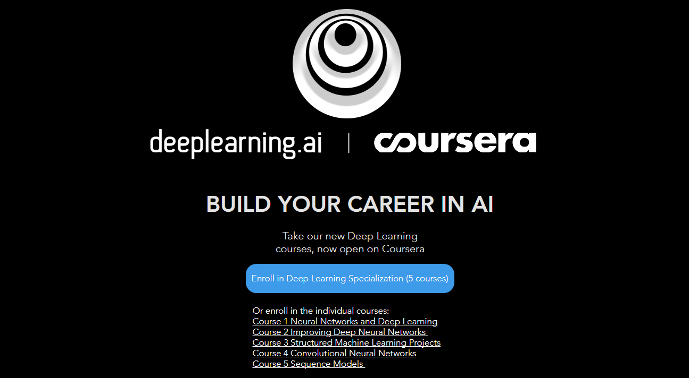

# Andrew-Ng-deeplearning.ai

## 课程介绍

从去年8月份开始，AI界大IP吴恩达在coursera上开设了由 5 门课组成的深度学习专项课程，掀起了一股人工智能深度学习热潮。这里附上deeplearning.ai的官网：

[deeplearning.ai](https://www.deeplearning.ai/)

关于该深度学习专项课程，本人非常推荐！它对于理解各种算法背后的原理非常有帮助，同时提供了大量的应用场景，涉及图像、语音、自然语言理解等各方面，还提供了一些工具函数、数据集。每一章节都配备了相应的实战项目代码，帮助学员从理论到实战入门深度学习！

本课程发布在 Coursera 平台上，相应地址为：

[https://www.coursera.org/specializations/deep-learning](https://www.coursera.org/specializations/deep-learning)

大家可以自行在 COursera 上学习 deeplearning.ai 专项课程。

不过对于英语不好的同学来说，有个好消息是网易云课堂与吴恩达合作，拿到了独家版权，开设了深度学习微专业课，并且提供中文字幕翻译，降低了学习门槛。但是只有视频和课件材料，没有 Coursera 上的作业、考试等环节，也不会提供证书，需要证书的还得去 Coursera 上学习。这里附上网易云课堂该专项课程的地址：

[https://mooc.study.163.com/smartSpec/detail/1001319001.htm](https://mooc.study.163.com/smartSpec/detail/1001319001.htm)

## 课程内容

吴恩达 deeplearning.ai 专项课程总共由 5 门课组成，分别是：

- **[神经网络与深度学习](https://redstonewill.com/category/ai-notes/andrew-deeplearning-ai/neural-network-and-deeplearning/)**

- **[优化深度神经网络](https://redstonewill.com/category/ai-notes/andrew-deeplearning-ai/improve-deeplearning/)**

- **[构建机器学习项目](https://redstonewill.com/category/ai-notes/andrew-deeplearning-ai/structured-ml-project/)**

- **[卷积神经网络CNN](https://redstonewill.com/category/ai-notes/andrew-deeplearning-ai/cnn/)**

- **[循环神经网络RNN](https://redstonewill.com/category/ai-notes/andrew-deeplearning-ai/rnn/)**

笔者在学习 deeplearning.ai 专项课程之际，也精心制作了每门课程及精炼笔记，把每节课的主要核心内容记录下来。现在所有的笔记都已完成。为了方便大家查阅，特地将所有的笔记进行汇总。完整的章节目录如下：

**1.神经网络与深度学习**

- **[深度学习概述](https://redstonewill.com/866/)**

- **[神经网络基础之逻辑回归](https://redstonewill.com/879/)**

- **[神经网络基础之Python与向量化](https://redstonewill.com/888/)**

- **[浅层神经网络](https://redstonewill.com/955/)**

- **[深层神经网络](https://redstonewill.com/975/)**

**2.优化深度神经网络**

- **[深度学习的实用层面](https://redstonewill.com/1052/)**

- **[优化算法](https://redstonewill.com/1077/)**

- **[超参数调试、Batch正则化和编程框架](https://redstonewill.com/1101/)**

**3.构建机器学习项目**

- **[机器学习策略（上）](https://redstonewill.com/1123/)**

- **[机器学习策略（下）](https://redstonewill.com/1138/)**

**4.卷积神经网络CNN**

- **[卷积神经网络基础](https://redstonewill.com/1215/)**

- **[深度卷积模型：案例研究](https://redstonewill.com/1240/)**

- **[目标检测](https://redstonewill.com/1263/)**

- **[人脸识别与神经风格迁移](https://redstonewill.com/1292/)**

**5.序列模型**

- **[循环神经网络（RNN）](https://redstonewill.com/1316/)**

- **[NLP和Word Embeddings](https://redstonewill.com/1356/)**

- **[序列模型和注意力机制](https://redstonewill.com/1377/)**

## 其它资料

吴恩达在 Coursera 上开设的机器学习入门课《Machine Learning》，这门课所有的视频、课件PPT、作业：

链接：https://pan.baidu.com/s/1I3bP48IJLTDGj0gH3LSlBg 

密码：bror

## 最后

如果觉得我的分享对你有用，那么就**Star**一下吧～同时，也欢迎大家关注我的微信公众号：AI有道（ID: redstonewill）。我会一如既往发布更多更好的文章给大家！一起学习，共同进步！

**个人主页：**

>我的网站：[http://redstonewill.com/](http://redstonewill.com/)

>我的CSDN：[http://blog.csdn.net/red_stone1](http://blog.csdn.net/red_stone1)

>我的知乎：[https://www.zhihu.com/people/red_stone_wl](https://www.zhihu.com/people/red_stone_wl)

>我的微信公众号：AI有道（ID：redstonewill）

